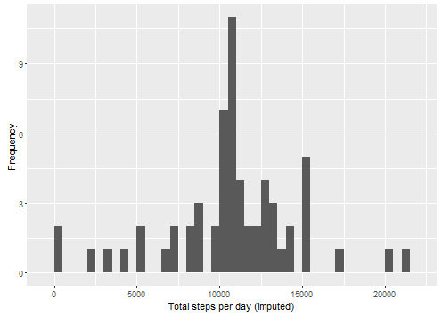

# Reproducible Research: Peer Assessment 1

```r
library(ggplot2)
library (Hmisc)
library(Scale)
```
## Loading and preprocessing the data
#### 1. Loading and reading the data
```r

unzip(zipfile="activity.zip")
import_data <- read.csv("activity.csv")[-1]
```
## What is mean total number of steps taken per day?
```r
Steps_total <- tapply(import_data$steps, import_data$date,sum, na.rm=TRUE)

```
##### 1. Make a histogram of the total number of steps taken each day
```r

qplot (Steps_total, xlab='Total Steps Per Day', ylab='Frequency', binwidth=500)
```


##### 2. Calculate and report the mean and median total number of steps taken per day

```r
mean(Steps_total , na.rm=TRUE)
median(Steps_total , na.rm=TRUE)
```


## What is the average daily activity pattern?
```r
averageSteps_time <- aggregate(x=list(meanSteps=import_data$steps), by=list(interval=import_Data$interval), mean, na.rm=TRUE)

```
##### 1. Make a time series plot

```r
ggplot(data=averageSteps_time, aes(x=interval, y=meanSteps)) +
  geom_line() +
  xlab("5 minute interval") +
  ylab("average steps taken") 
```


##### 2. Which 5-minute interval, on average across all the days in the dataset, contains the maximum number of steps?

```r
max_steps <- which.max(averageSteps_time$meanSteps)
no_max_steps <-  gsub("([0-9]{1,2})([0-9]{2})", "\\1:\\2", averageSteps_time[mostSteps,'interval'])

```


## Imputing missing values
##### 1. Calculate and report the total number of missing values in the dataset 
```r
missing_valuecount <- length(which(is.na(import_data$steps)))
```
##### 2. Devise a strategy for filling in all of the missing values in the dataset.
##### 3. Create a new dataset that is equal to the original dataset but with the missing data filled in.
```r
import_dataImputed <- import_data
import_dataImputed$steps <- impute(import_data$steps, mean)
```

##### 4. Make a histogram of the total number of steps taken each day 
```r
steps_perday_imputed <- tapply(import_dataImputed$steps, import_dataImputed$date, sum)
qplot(steps_perday_imputed, xlab='Total steps per day (Imputed)', ylab='Frequency ', binwidth=500)
```


##### ... and Calculate and report the mean and median total number of steps taken per day. 
```r
steps_perday_imputed_mean <- mean(steps_perday_imputed)
steps_perday_imputed_median <- median(steps_perday_imputed)
```


## Are there differences in activity patterns between weekdays and weekends?'''r

##### 1. Create a function to  indicate whether a given date is a weekday or weekend day.


```r
  day <- weekdays(date)
  if (day %in% c("Monday", "Tuesday", "Wednesday", "Thursday", "Friday"))
    return("weekday")
  else if (day %in% c("Saturday", "Sunday"))
    return("weekend")
  else
    stop("invalid date")
}
import_dataImputed$date <- as.Date(import_dataImputed$date)
import_dataImputed$day <- sapply(import_dataImputed$date, FUN=weekday.or.weekend)
```


##### 2. Make a panel plot containing a time series plot
```r

averages <- aggregate(steps ~ interval + day, data=import_dataImputed, mean)
ggplot(averages, aes(interval, steps)) + geom_line() + facet_grid(day ~ .) +
  xlab("5 minute interval") + ylab("Number of steps")
```
